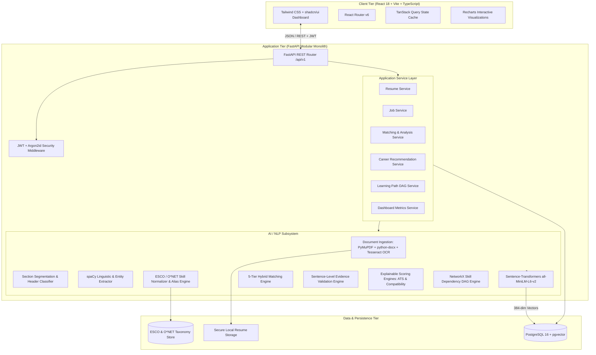
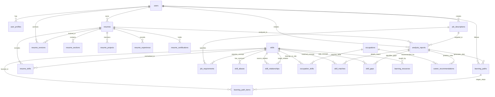
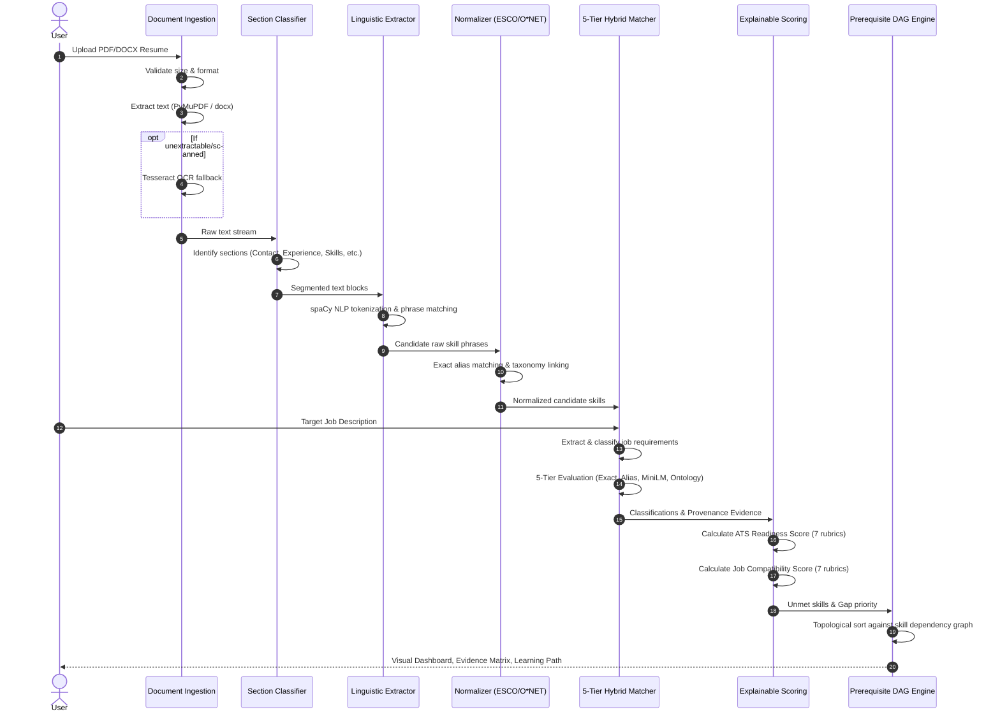
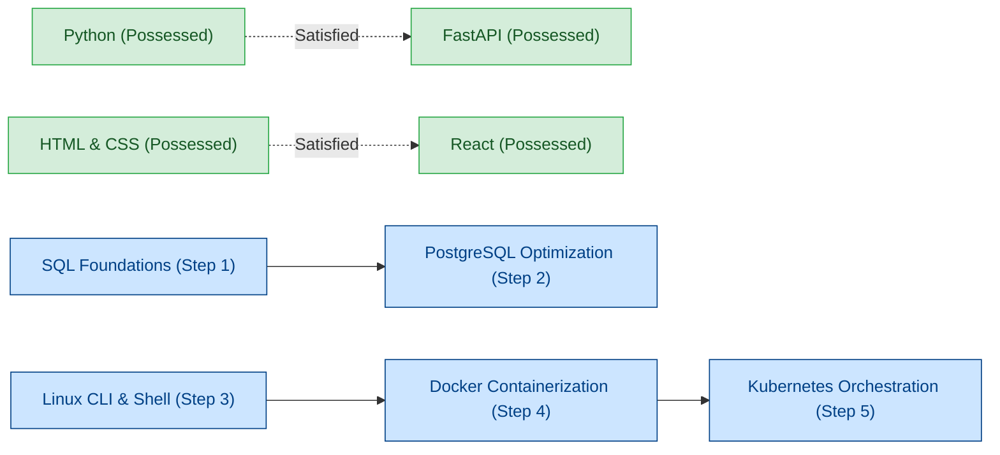

# SkillBridge AI: System Architecture & Engineering Specification

**Official Project Title:**  
*Semantic Resume - Job Matching and Skill Gap Analysis with Personalized Learning Path Recommendation*

**Project Internal Name:** SkillBridge AI  
**Project Classification:** AI/ML + NLP + Full-Stack Web Application  
**Target Environment:** Local & Containerized (Docker, Windows/Linux)  
**Academic Year:** Final-Year Capstone Engineering Project  

---

## 1. System Architecture Overview

SkillBridge AI is engineered as a **Modular Monolith** designed for high cohesion, low coupling, deterministic evaluation, and explainable AI/NLP reasoning. The platform decouples ingestion, linguistic parsing, taxonomic normalization, semantic vector retrieval, rule-based scoring, and learning path graph traversal into dedicated backend domains while providing a reactive, component-driven TypeScript frontend.



### 1.1 Architectural Design Principles
1. **Explainable AI First (No Black-Box Scoring):** Numerical ATS readiness and Job Compatibility scores are derived deterministically using documented academic rubrics rather than generative LLM approximations.
2. **Auditable Evidence Engine:** Every skill detected in a resume or matched against a job requirement preserves provenance: raw token, normalized concept, source section, exact evidence sentence, match classification, and confidence score.
3. **Defense-in-Depth Privacy & Security:** Resumes are treated as confidential. Ingestion pipelines scrub protected characteristics (gender, age, ethnicity, religion, photo references) prior to scoring. Logs never output raw resume text or personally identifiable data (PII).
4. **Deterministic Reproducibility:** Fixed random seeds, cached embedding models, and versioned taxonomies guarantee identical score generation for identical document inputs.

---

## 2. Directory & Package Structure

```text
resume_analyser_project/
├── .env.example
├── .gitignore
├── README.md
├── docker-compose.yml
├── docs/
│   ├── SYSTEM_ARCHITECTURE_AND_SPECIFICATION.md
│   ├── SCORING_RUBRICS.md
│   └── API_CONTRACTS.md
├── backend/
│   ├── Dockerfile
│   ├── requirements.txt
│   ├── pyproject.toml
│   ├── alembic.ini
│   ├── migrations/
│   │   ├── env.py
│   │   ├── script.py.mako
│   │   └── versions/
│   ├── app/
│   │   ├── __init__.py
│   │   ├── main.py
│   │   ├── core/
│   │   │   ├── __init__.py
│   │   │   ├── config.py
│   │   │   ├── database.py
│   │   │   ├── security.py
│   │   │   └── exceptions.py
│   │   ├── models/
│   │   │   ├── __init__.py
│   │   │   ├── user.py
│   │   │   ├── resume.py
│   │   │   ├── job.py
│   │   │   ├── skill.py
│   │   │   ├── analysis.py
│   │   │   ├── career.py
│   │   │   └── learning.py
│   │   ├── schemas/
│   │   │   ├── __init__.py
│   │   │   ├── auth.py
│   │   │   ├── user.py
│   │   │   ├── resume.py
│   │   │   ├── job.py
│   │   │   ├── skill.py
│   │   │   ├── analysis.py
│   │   │   ├── career.py
│   │   │   └── learning.py
│   │   ├── api/
│   │   │   ├── __init__.py
│   │   │   ├── deps.py
│   │   │   └── v1/
│   │   │       ├── __init__.py
│   │   │       ├── auth.py
│   │   │       ├── resumes.py
│   │   │       ├── jobs.py
│   │   │       ├── analysis.py
│   │   │       ├── careers.py
│   │   │       ├── learning.py
│   │   │       └── dashboard.py
│   │   ├── services/
│   │   │   ├── __init__.py
│   │   │   ├── auth_service.py
│   │   │   ├── resume_service.py
│   │   │   ├── job_service.py
│   │   │   ├── analysis_service.py
│   │   │   ├── career_service.py
│   │   │   ├── learning_service.py
│   │   │   └── dashboard_service.py
│   │   ├── ai/
│   │   │   ├── __init__.py
│   │   │   ├── ingestion/
│   │   │   │   ├── __init__.py
│   │   │   │   ├── pdf_parser.py
│   │   │   │   ├── docx_parser.py
│   │   │   │   ├── ocr_engine.py
│   │   │   │   └── validator.py
│   │   │   ├── segmentation/
│   │   │   │   ├── __init__.py
│   │   │   │   ├── section_classifier.py
│   │   │   │   └── patterns.py
│   │   │   ├── extraction/
│   │   │   │   ├── __init__.py
│   │   │   │   ├── spacy_pipeline.py
│   │   │   │   ├── entity_extractor.py
│   │   │   │   └── requirement_classifier.py
│   │   │   ├── normalization/
│   │   │   │   ├── __init__.py
│   │   │   │   ├── alias_mapper.py
│   │   │   │   ├── taxonomy_linker.py
│   │   │   │   └── esco_onet_loader.py
│   │   │   ├── matching/
│   │   │   │   ├── __init__.py
│   │   │   │   ├── hybrid_matcher.py
│   │   │   │   ├── vector_embedder.py
│   │   │   │   ├── ontology_reasoner.py
│   │   │   │   └── evidence_validator.py
│   │   │   ├── scoring/
│   │   │   │   ├── __init__.py
│   │   │   │   ├── ats_scorer.py
│   │   │   │   ├── compatibility_scorer.py
│   │   │   │   └── gap_prioritizer.py
│   │   │   ├── recommendations/
│   │   │   │   ├── __init__.py
│   │   │   │   └── career_recommender.py
│   │   │   └── learning_path/
│   │   │       ├── __init__.py
│   │   │       ├── dependency_graph.py
│   │   │       └── path_generator.py
│   │   ├── data/
│   │   │   ├── taxonomies/
│   │   │   │   ├── esco_skills_v1.2.parquet
│   │   │   │   ├── onet_competencies_28.parquet
│   │   │   │   └── occupation_profiles.json
│   │   │   ├── aliases/
│   │   │   │   └── skill_aliases.json
│   │   │   └── seeders/
│   │   │       ├── seed_taxonomies.py
│   │   │       └── seed_learning_resources.py
│   │   └── utils/
│   │       ├── __init__.py
│   │       ├── file_ops.py
│   │       └── text_cleaning.py
│   └── tests/
│       ├── conftest.py
│       ├── test_auth.py
│       ├── test_parsers.py
│       ├── test_extraction.py
│       ├── test_matching.py
│       ├── test_scoring.py
│       └── test_learning_graph.py
└── frontend/
    ├── Dockerfile
    ├── index.html
    ├── package.json
    ├── tsconfig.json
    ├── vite.config.ts
    ├── tailwind.config.js
    ├── postcss.config.js
    └── src/
        ├── App.tsx
        ├── main.tsx
        ├── routes/
        │   └── index.tsx
        ├── types/
        │   ├── auth.ts
        │   ├── resume.ts
        │   ├── job.ts
        │   ├── analysis.ts
        │   ├── career.ts
        │   └── learning.ts
        ├── services/
        │   ├── api.ts
        │   ├── authService.ts
        │   ├── resumeService.ts
        │   ├── jobService.ts
        │   ├── analysisService.ts
        │   ├── careerService.ts
        │   └── learningService.ts
        ├── hooks/
        │   ├── useAuth.ts
        │   ├── useResumes.ts
        │   ├── useAnalysis.ts
        │   └── useDashboard.ts
        ├── utils/
        │   ├── formatters.ts
        │   ├── scoring.ts
        │   └── download.ts
        ├── components/
        │   ├── ui/          # Accessible shadcn/ui components
        │   ├── layout/      # Navbar, Sidebar, PageContainer
        │   ├── dashboard/   # MetricsCards, RecentAnalyses, SkillRadar
        │   ├── resume/      # FileUploader, ParsedPreview, VersionDiff
        │   ├── job/         # JobInputModal, RequirementsTable
        │   ├── analysis/    # ATSScoreGauge, CompatibilityBreakdown, EvidenceCard
        │   ├── career/      # OccupationCard, AlignmentTree
        │   └── learning/    # RoadmapGraph, TaskList, ResourceDrawer
        └── pages/
            ├── LoginPage.tsx
            ├── RegisterPage.tsx
            ├── DashboardPage.tsx
            ├── ResumesPage.tsx
            ├── ResumeDetailPage.tsx
            ├── JobsPage.tsx
            ├── JobDetailPage.tsx
            ├── AnalysisDetailPage.tsx
            ├── CareerRecommendationsPage.tsx
            ├── LearningPathPage.tsx
            └── VersionComparePage.tsx
```

---

## 3. Database Entity-Relationship (ER) Design

The persistence model contains **23 relational tables** with foreign key constraints, indexes, and a `vector(384)` column for dense semantic embeddings enabled by `pgvector`.



### Table Definitions & Schemas

1. **`users`**: Authentication & account credentials.
   - `id`: UUID (PK)
   - `email`: VARCHAR(255) (UNIQUE, NOT NULL, Indexed)
   - `hashed_password`: VARCHAR(255) (NOT NULL)
   - `full_name`: VARCHAR(150) (NOT NULL)
   - `role`: VARCHAR(50) (DEFAULT 'student')
   - `is_active`: BOOLEAN (DEFAULT TRUE)
   - `created_at`: TIMESTAMPTZ (DEFAULT NOW())
   - `updated_at`: TIMESTAMPTZ (DEFAULT NOW())

2. **`user_profiles`**: Extended academic & professional profile details.
   - `id`: UUID (PK)
   - `user_id`: UUID (FK -> users.id ON DELETE CASCADE)
   - `current_title`: VARCHAR(150)
   - `target_role`: VARCHAR(150)
   - `bio`: TEXT
   - `phone`: VARCHAR(30)
   - `linkedin_url`: VARCHAR(255)
   - `github_url`: VARCHAR(255)
   - `created_at`: TIMESTAMPTZ
   - `updated_at`: TIMESTAMPTZ

3. **`resumes`**: Uploaded resume files and top-level parsing state.
   - `id`: UUID (PK)
   - `user_id`: UUID (FK -> users.id ON DELETE CASCADE)
   - `title`: VARCHAR(255) (NOT NULL)
   - `file_name`: VARCHAR(255) (NOT NULL)
   - `file_path`: VARCHAR(500) (NOT NULL)
   - `file_type`: VARCHAR(20) (NOT NULL) -- 'pdf' or 'docx'
   - `file_size_bytes`: INTEGER (NOT NULL)
   - `parsing_status`: VARCHAR(50) -- 'PENDING', 'PROCESSING', 'COMPLETED', 'FAILED'
   - `raw_text`: TEXT
   - `parsed_at`: TIMESTAMPTZ
   - `created_at`: TIMESTAMPTZ
   - `updated_at`: TIMESTAMPTZ

4. **`resume_sections`**: Granular segmented resume components.
   - `id`: UUID (PK)
   - `resume_id`: UUID (FK -> resumes.id ON DELETE CASCADE)
   - `section_type`: VARCHAR(50) (NOT NULL) -- 'CONTACT', 'SUMMARY', 'EXPERIENCE', 'EDUCATION', 'SKILLS', 'PROJECTS', 'CERTIFICATIONS', 'OTHER'
   - `section_title`: VARCHAR(150)
   - `content_text`: TEXT (NOT NULL)
   - `start_char`: INTEGER
   - `end_char`: INTEGER
   - `confidence_score`: NUMERIC(4, 3)

5. **`skills`**: Master taxonomy of canonical skills (from ESCO and O*NET).
   - `id`: UUID (PK)
   - `name`: VARCHAR(255) (UNIQUE, NOT NULL, Indexed)
   - `category`: VARCHAR(100) -- 'TECHNICAL', 'SOFT', 'TOOL', 'FRAMEWORK', 'DOMAIN'
   - `taxonomy_source`: VARCHAR(50) -- 'ESCO', 'ONET', 'CUSTOM'
   - `taxonomy_code`: VARCHAR(100)
   - `description`: TEXT
   - `embedding`: vector(384) (pgvector index: ivfflat or hnsw)
   - `created_at`: TIMESTAMPTZ

6. **`skill_aliases`**: Common acronyms, typos, frameworks, and lexical variations.
   - `id`: UUID (PK)
   - `skill_id`: UUID (FK -> skills.id ON DELETE CASCADE)
   - `alias`: VARCHAR(255) (NOT NULL, Indexed)
   - `alias_type`: VARCHAR(50) -- 'ACRONYM', 'SYNONYM', 'SPELLING_VARIANT', 'FRAMEWORK_SUBSET'
   - `created_at`: TIMESTAMPTZ

7. **`skill_relationships`**: Ontological dependency and taxonomy edges.
   - `id`: UUID (PK)
   - `source_skill_id`: UUID (FK -> skills.id ON DELETE CASCADE)
   - `target_skill_id`: UUID (FK -> skills.id ON DELETE CASCADE)
   - `relationship_type`: VARCHAR(50) -- 'PREREQUISITE_OF', 'RELATED_TO', 'SPECIALIZATION_OF', 'PARENT_OF'
   - `strength_weight`: NUMERIC(3, 2) (DEFAULT 1.00)

8. **`resume_skills`**: Skills extracted from candidate resumes with sentence-level proof.
   - `id`: UUID (PK)
   - `resume_id`: UUID (FK -> resumes.id ON DELETE CASCADE)
   - `skill_id`: UUID (FK -> skills.id ON DELETE RESTRICT)
   - `raw_skill_text`: VARCHAR(255) (NOT NULL)
   - `canonical_skill_name`: VARCHAR(255) (NOT NULL)
   - `confidence`: NUMERIC(4, 3) (NOT NULL)
   - `match_method`: VARCHAR(50) -- 'EXACT', 'ALIAS', 'SEMANTIC_EMBEDDING'
   - `source_section`: VARCHAR(50)
   - `evidence_sentence`: TEXT (NOT NULL)
   - `created_at`: TIMESTAMPTZ

9. **`resume_projects`**: Extracted technical projects.
   - `id`: UUID (PK)
   - `resume_id`: UUID (FK -> resumes.id ON DELETE CASCADE)
   - `project_name`: VARCHAR(255) (NOT NULL)
   - `role`: VARCHAR(150)
   - `description`: TEXT
   - `technologies_used`: JSONB (ARRAY of strings)
   - `url`: VARCHAR(255)
   - `start_date`: DATE
   - `end_date`: DATE

10. **`resume_experience`**: Employment, internships, and work history.
    - `id`: UUID (PK)
    - `resume_id`: UUID (FK -> resumes.id ON DELETE CASCADE)
    - `company_name`: VARCHAR(255) (NOT NULL)
    - `job_title`: VARCHAR(150) (NOT NULL)
    - `location`: VARCHAR(150)
    - `description`: TEXT
    - `start_date`: DATE
    - `end_date`: DATE
    - `is_current`: BOOLEAN (DEFAULT FALSE)

11. **`resume_certifications`**: Professional credentials and accreditations.
    - `id`: UUID (PK)
    - `resume_id`: UUID (FK -> resumes.id ON DELETE CASCADE)
    - `name`: VARCHAR(255) (NOT NULL)
    - `issuing_organization`: VARCHAR(255)
    - `issue_date`: DATE
    - `expiration_date`: DATE
    - `credential_id`: VARCHAR(150)
    - `credential_url`: VARCHAR(255)

12. **`job_descriptions`**: Target job openings inputted by candidate.
    - `id`: UUID (PK)
    - `user_id`: UUID (FK -> users.id ON DELETE CASCADE)
    - `title`: VARCHAR(255) (NOT NULL)
    - `company`: VARCHAR(255)
    - `location`: VARCHAR(150)
    - `raw_text`: TEXT (NOT NULL)
    - `experience_level`: VARCHAR(50) -- 'ENTRY', 'MID', 'SENIOR'
    - `created_at`: TIMESTAMPTZ
    - `updated_at`: TIMESTAMPTZ

13. **`job_requirements`**: Structured requirements extracted from job text.
    - `id`: UUID (PK)
    - `job_id`: UUID (FK -> job_descriptions.id ON DELETE CASCADE)
    - `requirement_type`: VARCHAR(50) (NOT NULL) -- 'REQUIRED', 'PREFERRED', 'QUALIFICATION', 'EXPERIENCE', 'CERTIFICATION'
    - `raw_text`: TEXT (NOT NULL)
    - `canonical_skill_id`: UUID (FK -> skills.id NULLABLE)
    - `importance_weight`: NUMERIC(3, 2) (DEFAULT 1.00)
    - `parsed_at`: TIMESTAMPTZ

14. **`occupations`**: Standard career benchmarks from O*NET and ESCO.
    - `id`: UUID (PK)
    - `title`: VARCHAR(255) (NOT NULL)
    - `code`: VARCHAR(50) (UNIQUE, NOT NULL)
    - `taxonomy_source`: VARCHAR(50) -- 'ESCO', 'ONET'
    - `description`: TEXT
    - `embedding`: vector(384)
    - `created_at`: TIMESTAMPTZ

15. **`occupation_skills`**: Core competency profiles per occupation.
    - `id`: UUID (PK)
    - `occupation_id`: UUID (FK -> occupations.id ON DELETE CASCADE)
    - `skill_id`: UUID (FK -> skills.id ON DELETE CASCADE)
    - `importance_level`: NUMERIC(3, 2)
    - `frequency_score`: NUMERIC(3, 2)

16. **`analysis_reports`**: Master comparative evaluation run between a resume and job description.
    - `id`: UUID (PK)
    - `user_id`: UUID (FK -> users.id ON DELETE CASCADE)
    - `resume_id`: UUID (FK -> resumes.id ON DELETE CASCADE)
    - `job_id`: UUID (FK -> job_descriptions.id ON DELETE CASCADE)
    - `ats_readiness_score`: NUMERIC(5, 2) (NOT NULL)
    - `ats_breakdown_json`: JSONB (NOT NULL)
    - `job_compatibility_score`: NUMERIC(5, 2) (NOT NULL)
    - `compatibility_breakdown_json`: JSONB (NOT NULL)
    - `executive_summary`: TEXT
    - `generated_at`: TIMESTAMPTZ (DEFAULT NOW())

17. **`skill_matches`**: Granular itemized requirement matching outcomes.
    - `id`: UUID (PK)
    - `analysis_id`: UUID (FK -> analysis_reports.id ON DELETE CASCADE)
    - `job_requirement_id`: UUID (FK -> job_requirements.id ON DELETE CASCADE)
    - `resume_skill_id`: UUID (FK -> resume_skills.id NULLABLE)
    - `skill_id`: UUID (FK -> skills.id ON DELETE RESTRICT)
    - `match_class`: VARCHAR(50) (NOT NULL) -- 'EXACT', 'SEMANTIC', 'RELATED', 'PARTIAL', 'MISSING'
    - `similarity_score`: NUMERIC(4, 3) (NOT NULL)
    - `confidence`: NUMERIC(4, 3) (NOT NULL)
    - `evidence_sentence`: TEXT
    - `match_explanation`: TEXT (NOT NULL)

18. **`skill_gaps`**: Identified missing skills with multi-factor prioritization.
    - `id`: UUID (PK)
    - `analysis_id`: UUID (FK -> analysis_reports.id ON DELETE CASCADE)
    - `skill_id`: UUID (FK -> skills.id ON DELETE RESTRICT)
    - `priority`: VARCHAR(20) (NOT NULL) -- 'CRITICAL', 'HIGH', 'MEDIUM', 'LOW'
    - `relevance_score`: NUMERIC(4, 3) (NOT NULL)
    - `requirement_importance`: NUMERIC(4, 3) (NOT NULL)
    - `career_importance`: NUMERIC(4, 3) (NOT NULL)
    - `dependency_importance`: NUMERIC(4, 3) (NOT NULL)
    - `rationale`: TEXT (NOT NULL)

19. **`career_recommendations`**: Alternative compatible career pathways.
    - `id`: UUID (PK)
    - `analysis_id`: UUID (FK -> analysis_reports.id ON DELETE CASCADE)
    - `occupation_id`: UUID (FK -> occupations.id ON DELETE CASCADE)
    - `match_score`: NUMERIC(5, 2) (NOT NULL)
    - `rationale`: TEXT (NOT NULL)
    - `missing_critical_skills_json`: JSONB
    - `recommended_at`: TIMESTAMPTZ (DEFAULT NOW())

20. **`learning_paths`**: Master recommended roadmap container.
    - `id`: UUID (PK)
    - `analysis_id`: UUID (FK -> analysis_reports.id ON DELETE CASCADE)
    - `user_id`: UUID (FK -> users.id ON DELETE CASCADE)
    - `title`: VARCHAR(255) (NOT NULL)
    - `total_estimated_hours`: INTEGER (NOT NULL)
    - `status`: VARCHAR(50) (DEFAULT 'ACTIVE')
    - `created_at`: TIMESTAMPTZ (DEFAULT NOW())
    - `updated_at`: TIMESTAMPTZ (DEFAULT NOW())

21. **`learning_path_items`**: Topologically sorted skill study steps.
    - `id`: UUID (PK)
    - `learning_path_id`: UUID (FK -> learning_paths.id ON DELETE CASCADE)
    - `skill_id`: UUID (FK -> skills.id ON DELETE RESTRICT)
    - `step_order`: INTEGER (NOT NULL)
    - `estimated_hours`: INTEGER (NOT NULL)
    - `status`: VARCHAR(50) (DEFAULT 'NOT_STARTED') -- 'NOT_STARTED', 'IN_PROGRESS', 'COMPLETED'
    - `prerequisite_item_ids_json`: JSONB (ARRAY of UUIDs)

22. **`learning_resources`**: Curated open-access educational materials.
    - `id`: UUID (PK)
    - `skill_id`: UUID (FK -> skills.id ON DELETE CASCADE)
    - `title`: VARCHAR(255) (NOT NULL)
    - `resource_type`: VARCHAR(50) -- 'COURSE', 'DOCUMENTATION', 'BOOK', 'TUTORIAL', 'PRACTICE'
    - `provider`: VARCHAR(150)
    - `url`: VARCHAR(500) (NOT NULL)
    - `estimated_minutes`: INTEGER
    - `difficulty_level`: VARCHAR(50) -- 'BEGINNER', 'INTERMEDIATE', 'ADVANCED'

23. **`resume_versions`**: Historical revision tracking for progress measurement.
    - `id`: UUID (PK)
    - `user_id`: UUID (FK -> users.id ON DELETE CASCADE)
    - `resume_id`: UUID (FK -> resumes.id ON DELETE CASCADE)
    - `version_number`: INTEGER (NOT NULL)
    - `changelog`: TEXT
    - `ats_score`: NUMERIC(5, 2)
    - `compatibility_score`: NUMERIC(5, 2)
    - `created_at`: TIMESTAMPTZ (DEFAULT NOW())

---

## 4. API Specification (REST / OpenAPI 3.1)

All endpoints reside under `/api/v1` and communicate via JSON (except file upload `multipart/form-data`). Authenticated endpoints mandate `Authorization: Bearer <JWT_ACCESS_TOKEN>`.

### 4.1 Authentication Endpoints
- `POST /api/v1/auth/register`
  - Request: `{ "email": "student@college.edu", "password": "SecurePassword123!", "full_name": "Alex Carter" }`
  - Response (201): `{ "user": { "id": "uuid", "email": "student@college.edu", "full_name": "Alex Carter" }, "access_token": "jwt_token", "token_type": "bearer" }`
- `POST /api/v1/auth/login`
  - Request: Form or JSON `{ "username": "student@college.edu", "password": "SecurePassword123!" }`
  - Response (200): `{ "access_token": "jwt_token", "token_type": "bearer" }`
- `GET /api/v1/auth/me`
  - Headers: `Authorization: Bearer <token>`
  - Response (200): `{ "id": "uuid", "email": "...", "full_name": "...", "role": "student", "created_at": "..." }`

### 4.2 Resume Management Endpoints
- `POST /api/v1/resumes/upload`
  - Request: `multipart/form-data` (file: `resume.pdf` or `resume.docx`, title: optional string)
  - Validation: Max 10MB; allowed MIME: `application/pdf`, `application/vnd.openxmlformats-officedocument.wordprocessingml.document`
  - Response (202 Accepted / 201 Created):
    ```json
    {
      "id": "uuid",
      "title": "Alex_Carter_SWE_Resume",
      "file_name": "resume.pdf",
      "parsing_status": "COMPLETED",
      "sections_detected": ["CONTACT", "SUMMARY", "EXPERIENCE", "EDUCATION", "SKILLS", "PROJECTS"],
      "skills_count": 18,
      "parsed_at": "2026-09-29T18:55:00Z"
    }
    ```
- `GET /api/v1/resumes`
  - Response (200): Array of summary objects `[{ "id": "uuid", "title": "...", "created_at": "...", "parsing_status": "..." }]`
- `GET /api/v1/resumes/{id}`
  - Response (200): Full structured resume containing sections, normalized skills with evidence sentences, experience items, projects, certifications.
- `DELETE /api/v1/resumes/{id}`
  - Response (204 No Content)

### 4.3 Job Description Endpoints
- `POST /api/v1/jobs`
  - Request:
    ```json
    {
      "title": "Junior Full Stack Engineer",
      "company": "Tech Innovations Inc.",
      "raw_text": "We are seeking a Junior Full Stack Engineer with strong experience in React, TypeScript, FastAPI, and PostgreSQL. Familiarity with Docker and Git is required. Experience with AWS is a plus."
    }
    ```
  - Response (201): Returns parsed job, structured requirements classified into `REQUIRED`, `PREFERRED`, `QUALIFICATION`, `EXPERIENCE`, and extracted skills.
- `GET /api/v1/jobs`
  - Response (200): List of user-submitted jobs.
- `GET /api/v1/jobs/{id}`
  - Response (200): Job record with classified requirements.

### 4.4 Semantic Analysis & Matching Endpoints
- `POST /api/v1/analysis/resume/{resume_id}/job/{job_id}`
  - Triggers pipeline: Hybrid matching, evidence engine, gap calculation, dual scoring rubric, career recommendation, learning path generation.
  - Response (200):
    ```json
    {
      "analysis_id": "uuid",
      "resume_id": "uuid",
      "job_id": "uuid",
      "ats_readiness_score": 86.5,
      "ats_breakdown": {
        "resume_structure": 15.0,
        "section_completeness": 14.5,
        "keyword_coverage": 17.0,
        "parseability": 15.0,
        "experience_project_evidence": 13.0,
        "formatting": 8.0,
        "basic_information": 10.0
      },
      "job_compatibility_score": 78.4,
      "compatibility_breakdown": {
        "required_skill_coverage": 30.5,
        "semantic_skill_alignment": 16.8,
        "experience_alignment": 12.0,
        "project_evidence": 8.5,
        "qualification_alignment": 9.0,
        "preferred_skills": 3.6,
        "certification_alignment": 4.0
      },
      "total_matches": 14,
      "total_gaps": 4,
      "disclaimer": "Scores represent the platform's project-defined ATS Readiness and Job Compatibility evaluations for academic career development and decision support. They do not represent proprietary hiring algorithms."
    }
    ```
- `GET /api/v1/analysis/{analysis_id}`
  - Response (200): Full detailed breakdown, including:
    - `matches`: Array of `{ skill_name, match_class, similarity_score, confidence, evidence_sentence, source_section, rationale }`
    - `gaps`: Array of `{ skill_name, priority, relevance_score, dependency_importance, rationale }`
    - Full score components and explanation text.

### 4.5 Career Recommendation Endpoints
- `GET /api/v1/careers/recommendations/{analysis_id}`
  - Response (200): Top matched occupation profiles (from O*NET/ESCO), compatibility indices, required skill overlaps, and rationale.

### 4.6 Learning Path & Resource Endpoints
- `GET /api/v1/learning/{analysis_id}`
  - Response (200): Prerequisite-aware sequenced curriculum DAG, step numbers, estimated study hours, prerequisite linkages, and open educational resources per skill.
- `PATCH /api/v1/learning/progress/{item_id}`
  - Request: `{ "status": "COMPLETED" }`
  - Response (200): Updated progress item and overall path completion percentage.

### 4.7 Dashboard & Version Tracking Endpoints
- `GET /api/v1/dashboard`
  - Response (200): Aggregate metrics (mean scores, total resumes analyzed, active learning paths, top missing skills across runs).
- `GET /api/v1/resumes/{id}/versions`
  - Response (200): Historical list of revisions with ATS and compatibility score progression diffs.

---

## 5. AI/NLP Pipeline Specification



### 5.1 Document Ingestion & Text Extraction
1. **PyMuPDF (`fitz`):** Extracts direct text streams, bounding boxes, character fonts, and structural flags from PDF files.
2. **`python-docx`:** Iterates through document paragraphs, runs, tables, and headers to extract native text.
3. **Tesseract OCR Fallback:**
   - Triggers when PyMuPDF returns fewer than 50 alphanumeric characters from a PDF page.
   - Converts PDF pages to 300 DPI images via `pdf2image`.
   - Preprocesses images with OpenCV: Grayscale conversion $\to$ Otsu's adaptive thresholding $\to$ Deskewing.
   - Executes `pytesseract.image_to_string` with page segmentation mode `PSM 6` (uniform block of text) or `PSM 3` (automatic).

### 5.2 Section Segmentation Engine
- Recognizes canonical resume sections using regular expression token boundaries and NLP line-classification:
  - `CONTACT`: Name, email regex `[a-zA-Z0-9_.+-]+@[a-zA-Z0-9-]+\.[a-zA-Z0-9-.]+`, phone, links.
  - `SUMMARY`: Objective, professional summary, profile.
  - `EXPERIENCE`: Professional experience, employment, work history, internships.
  - `EDUCATION`: Degrees, universities, GPA, coursework.
  - `SKILLS`: Technical skills, programming languages, tools, frameworks, core competencies.
  - `PROJECTS`: Academic and personal projects, capstones, repositories.
  - `CERTIFICATIONS`: Licenses, credentials, courses.
- Stores character slice offsets (`start_char`, `end_char`) for source tracing.

### 5.3 Skill Normalization & Taxonomic Mapping
- **Linguistic Extraction:** spaCy `en_core_web_sm` tokenization, POS tagging, noun-chunk parsing, and `PhraseMatcher` / `EntityRuler`.
- **Knowledge Sources:**
  - European Skills, Competences, Qualifications and Occupations (**ESCO** v1.2): 13,800+ skill concepts.
  - Occupational Information Network (**O*NET** 28.0): Standardized competency hierarchy.
  - Custom Curated Alias Dictionary: Maps abbreviations, acronyms, and modern industry terminology (e.g., `k8s` $\to$ `Kubernetes`, `react.js` $\to$ `React`, `aws ec2` $\to$ `Amazon EC2`, `ts` $\to$ `TypeScript`).
- **Dense Embedding Engine:**
  - Model: `sentence-transformers/all-MiniLM-L6-v2` (384-dimensional dense vectors).
  - Cosine similarity:
    $$\text{CosineSim}(\mathbf{u}, \mathbf{v}) = \frac{\mathbf{u} \cdot \mathbf{v}}{\|\mathbf{u}\|_2 \|\mathbf{v}\|_2}$$

### 5.4 5-Tier Hybrid Matching Engine
For each required skill $s_{job} \in S_{job}$ in the target job:
1. **Tier 1: EXACT MATCH**
   - Exact string equality (case-insensitive) between canonical names.
   - Classification: `EXACT`, Confidence: 1.00.
2. **Tier 2: ALIAS MATCH**
   - Exact string match between raw resume skill text and an alias associated with the target skill in the alias dictionary.
   - Classification: `EXACT`, Confidence: 0.95.
3. **Tier 3: SEMANTIC EMBEDDING MATCH**
   - Cosine similarity between `all-MiniLM-L6-v2` embeddings of candidate skill and target skill.
   - If $\text{sim} \ge 0.85$: Classification `SEMANTIC`, Confidence = $\text{sim}$.
4. **Tier 4: RELATED & PARTIAL ONTOLOGY MATCH**
   - If $0.70 \le \text{sim} < 0.85$: Check ESCO/O*NET taxonomic relationships (is a child/parent/sibling node in the skill taxonomy). If relationship exists: Classification `RELATED`, Confidence = $\text{sim}$.
   - If $0.55 \le \text{sim} < 0.70$: Classification `PARTIAL`, Confidence = $\text{sim}$.
5. **Tier 5: MISSING SKILL**
   - If $\text{sim} < 0.55$: Candidate has no demonstrable evidence for the required skill.
   - Classification: `MISSING`, Confidence: 0.00.

### 5.5 Evidence Validation Engine
Every detected match must output verifiable evidence:
- `normalized_skill`: Canonical skill label (e.g., `"Docker"`).
- `original_text`: Exact substring extracted from resume (e.g., `"Docker containerization"`).
- `source_section`: Section where skill occurred (e.g., `"PROJECTS"`).
- `evidence_sentence`: Full sentence containing the mention (e.g., `"Containerized the FastAPI application using Docker and deployed to AWS ECS."`).
- `confidence`: Calculated confidence score $[0.0 - 1.0]$.
- `matching_method`: `EXACT`, `ALIAS`, `SEMANTIC_EMBEDDING`, or `ONTOLOGY_RELATION`.

### 5.6 Skill Gap Prioritization Formulation
Each missing skill $s \in S_{missing}$ is ranked by priority score $P(s) \in [0, 1]$:
$$P(s) = 0.40 \cdot R(s) + 0.25 \cdot I(s) + 0.20 \cdot C(s) + 0.15 \cdot D(s)$$
Where:
- $R(s)$: Requirement Relevance ($1.0$ for `REQUIRED`, $0.5$ for `PREFERRED`).
- $I(s)$: Requirement Frequency & Prominence in Job Description ($[0.0, 1.0]$ normalized).
- $C(s)$: Career Importance ($[0.0, 1.0]$ based on frequency in target O*NET occupation profile).
- $D(s)$: Dependency Centrality (out-degree in skill dependency DAG: foundational skills unlock multiple downstream skills).

**Priority Bands:**
- $P(s) \ge 0.75$: **CRITICAL** (blocking core job competency)
- $0.55 \le P(s) < 0.75$: **HIGH** (strongly recommended)
- $0.35 \le P(s) < 0.55$: **MEDIUM** (competitive advantage)
- $P(s) < 0.35$: **LOW** (supplementary)

---

## 6. Scoring Specification

### 6.1 ATS Readiness Score (Formula & Rubric)
The ATS Readiness Score quantifies how cleanly, comprehensively, and structurally sound the resume is for standard parsing algorithms.

$$\text{ATS Readiness Score} = \sum_{k=1}^7 w_k \cdot C_k \quad \in [0, 100]$$

| Component ($k$) | Weight ($w_k$) | Evaluation Criteria |
|---|---|---|
| **1. Resume Structure** | 15% | Standard logical flow, absence of multi-column parsing degradation, clean section demarcations. |
| **2. Section Completeness** | 15% | Presence of essential sections: Contact (3%), Education (3%), Experience (3%), Skills (3%), Projects/Summary (3%). |
| **3. Keyword Coverage** | 20% | Domain technical skill density, action verbs (e.g., *engineered*, *implemented*, *architected*), measurable metrics. |
| **4. Parseability** | 15% | Text clean-extraction ratio, absence of unrecognized symbols, OCR degradation, or broken encodings. |
| **5. Experience/Project Evidence** | 15% | Measurable outcomes (percentages, speedups, scale), bullet-point structure, technology stacks identified. |
| **6. Formatting** | 10% | Page length discipline (1-2 pages: 10%, >3 pages: 5%), date consistency (e.g., `MM/YYYY`), email/phone layout. |
| **7. Basic Information** | 10% | Candidate full name (3%), valid email address (3%), phone number (2%), professional link/portfolio (2%). |

### 6.2 Job Compatibility Score (Formula & Rubric)
The Job Compatibility Score quantifies how thoroughly the candidate's verified skills, experience, and qualifications fulfill the specific job posting.

$$\text{Job Compatibility Score} = \sum_{j=1}^7 w_j \cdot M_j \quad \in [0, 100]$$

| Component ($j$) | Weight ($w_j$) | Evaluation Criteria & Formula |
|---|---|---|
| **1. Required Skill Coverage** | 35% | Weighted sum of match tiers for all `REQUIRED` skills:<br>$\frac{1}{|S_{req}|} \sum \text{TierWeight}(s)$ where Exact=1.0, Semantic=0.85, Related=0.60, Partial=0.30, Missing=0.0. |
| **2. Semantic Skill Alignment** | 20% | Global cosine similarity between aggregated candidate skill vector space and target job skill vector space. |
| **3. Experience Alignment** | 15% | Candidate verified experience duration vs job stated experience level (Entry: 0-2 yrs, Mid: 3-5 yrs, Senior: 5+ yrs). |
| **4. Project Evidence** | 10% | Proportion of target job technologies demonstrated inside documented `PROJECTS` sections with actionable descriptions. |
| **5. Qualification Alignment** | 10% | Degree level (B.S., M.S., Ph.D.) and academic discipline alignment against job posting requirements. |
| **6. Preferred Skills** | 5% | Proportion of `PREFERRED` / "nice-to-have" skills matched from the job posting. |
| **7. Certification Alignment** | 5% | Presence of industry certifications relevant to the target role (e.g., AWS Certified, CKA, Security+). |

### 6.3 Explainability JSON Schema Output
```json
{
  "ats_readiness": {
    "overall_score": 84.5,
    "breakdown": {
      "resume_structure": { "score": 15.0, "max": 15, "status": "EXCELLENT", "feedback": "Clear linear hierarchy." },
      "section_completeness": { "score": 15.0, "max": 15, "status": "EXCELLENT", "detected": ["CONTACT", "SUMMARY", "EXPERIENCE", "EDUCATION", "SKILLS", "PROJECTS"] },
      "keyword_coverage": { "score": 15.5, "max": 20, "status": "GOOD", "feedback": "Good density; consider adding more quantitative performance metrics." },
      "parseability": { "score": 14.0, "max": 15, "status": "EXCELLENT", "feedback": "Clean UTF-8 text extraction; no OCR anomalies." },
      "experience_project_evidence": { "score": 12.0, "max": 15, "status": "GOOD", "feedback": "3 out of 4 projects specify technology stacks." },
      "formatting": { "score": 9.0, "max": 10, "status": "EXCELLENT", "feedback": "Consistent dates and optimal 1-page length." },
      "basic_information": { "score": 9.0, "max": 10, "status": "EXCELLENT", "feedback": "Found name, email, phone, and GitHub profile." }
    }
  },
  "job_compatibility": {
    "overall_score": 76.2,
    "breakdown": {
      "required_skill_coverage": { "score": 28.0, "max": 35, "matched": 8, "total_required": 10 },
      "semantic_skill_alignment": { "score": 16.2, "max": 20, "cosine_similarity": 0.81 },
      "experience_alignment": { "score": 12.0, "max": 15, "candidate_years": 1.5, "required_level": "ENTRY" },
      "project_evidence": { "score": 8.0, "max": 10, "demonstrated_skills": ["React", "FastAPI", "PostgreSQL"] },
      "qualification_alignment": { "score": 10.0, "max": 10, "degree_match": "B.Tech Computer Science" },
      "preferred_skills": { "score": 3.0, "max": 5, "matched": ["Docker"], "missing": ["AWS ECS"] },
      "certification_alignment": { "score": 0.0, "max": 5, "feedback": "No cloud certifications detected." }
    }
  }
}
```

---

## 7. Prerequisite-Aware Learning Path Synthesis (DAG)

SkillBridge AI organizes skill learning as a **Directed Acyclic Graph (DAG)** $G = (V, E)$, where vertices $V$ represent skills and directed edges $E = \{(u, v)\}$ denote that skill $u$ is a strict prerequisite of skill $v$.



### 7.1 Graph Rules
1. **Possession Pruning:** Skills already demonstrably verified in the candidate's resume (at `EXACT` or `SEMANTIC` confidence) are marked as satisfied and excluded from future required study items.
2. **Topological Ordering:** The graph is traversed via Kahn's algorithm or Depth-First Search topological sort. Foundational skills (in-degree = 0 among remaining gaps) are sequenced before advanced frameworks.
3. **Resource Pairing:** Each sequenced node is paired with curated open-source resources (official documentation, reputable video courses, interactive tutorials, and practice sandboxes).

---

## 8. Complete 10-Phase Engineering Roadmap

- **Phase 1: Project Setup & Core Infrastructure**
  - Initialize modular monolithic directory layout.
  - Configure PostgreSQL 16 with `pgvector`.
  - Implement FastAPI backend scaffolding, CORS, exception handling, and Pydantic v2 schemas.
  - Implement JWT authentication and Argon2id password hashing (`/api/v1/auth/register`, `/login`, `/me`).
  - Scaffold React + TypeScript + Vite + Tailwind CSS + shadcn/ui frontend.
  - Containerize using multi-stage `docker-compose.yml`.
- **Phase 2: Resume Ingestion & Parsing Subsystem**
  - Implement PyMuPDF and `python-docx` file extractors.
  - Implement OpenCV + Tesseract OCR fallback for scanned resumes.
  - Implement Section Segmentation Engine (Contact, Experience, Education, Skills, Projects, Certifications).
  - Store parsed resumes in `resumes` and `resume_sections` tables.
- **Phase 3: Skill Normalization & Taxonomy Integration**
  - Ingest and seed ESCO v1.2 and O*NET 28.0 skill taxonomies into PostgreSQL.
  - Implement local skill alias dictionary (1,500+ curated tech terms and acronyms).
  - Build spaCy NLP skill extractor with noun phrase matcher.
  - Integrate `sentence-transformers/all-MiniLM-L6-v2` to compute canonical skill embeddings.
- **Phase 4: Job Description Requirement Analysis**
  - Implement job description ingestion API.
  - Build NLP classifier for requirement categorization (`REQUIRED`, `PREFERRED`, `QUALIFICATION`, `EXPERIENCE`, `CERTIFICATION`).
  - Extract and normalize required job skills to canonical taxonomy.
- **Phase 5: Hybrid Matching & Evidence Validation Engine**
  - Implement 5-tier matching engine (`EXACT`, `ALIAS`, `SEMANTIC`, `RELATED`, `PARTIAL`, `MISSING`).
  - Execute dense vector cosine similarity via `pgvector`.
  - Implement sentence-level Evidence Validation Engine capturing provenance quotes.
- **Phase 6: Skill Gap Prioritization & Scoring Engine**
  - Formulate multi-factor Skill Gap Priority algorithm.
  - Implement explainable ATS Readiness Scoring Engine (7 weighted rubrics).
  - Implement explainable Job Compatibility Scoring Engine (7 weighted rubrics).
  - Generate structured explainability JSON breakdown.
- **Phase 7: Career Recommendation Engine**
  - Vectorize candidate aggregate skill profiles.
  - Match candidate profile against ESCO/O*NET occupation vector embeddings.
  - Generate career recommendations with rationale and missing skill previews.
- **Phase 8: Prerequisite-Aware Learning Path Synthesis**
  - Model skill prerequisite graph in NetworkX.
  - Implement topological sort pruning possessed skills.
  - Link open-access educational resources and enable step-by-step progress tracking.
- **Phase 9: Frontend Interactive Dashboard & Version Comparison**
  - Build executive dashboard with Recharts (skill radar, score progress gauges, gap bar charts).
  - Build Evidence Drawer detailing sentence provenance.
  - Build Interactive Roadmap visualization.
  - Build Resume Version Comparison matrix.
- **Phase 10: Testing, Evaluation, Hardening & Deployment**
  - Write unit and integration test suites (Pytest & Vitest).
  - Benchmark inference latency and parse accuracy.
  - Conduct security review (SQL injection, XSS, rate limiting, PII sanitization).
  - Finalize production Docker Compose and deployment documentation.

---

## 9. Environment Requirements & Initial Setup Commands

### 9.1 Hardware & System Prerequisites
- **Operating System:** Windows 10/11 64-bit, macOS, or Ubuntu 22.04+ LTS.
- **Python:** Python 3.12 (64-bit).
- **Node.js:** Node.js v20.x or v22.x LTS, with `npm` or `pnpm`.
- **Database:** PostgreSQL 16 with `pgvector` extension installed.
- **OCR Engine:** Tesseract OCR (v5.x) installed on system PATH.
- **RAM:** Minimum 8GB recommended (for local execution of `all-MiniLM-L6-v2`).

### 9.2 Initial Setup Commands (PowerShell / Windows)

```powershell
# 1. Verify system dependencies
python --version          # Expected: Python 3.12.x
node --version            # Expected: v20.x.x or v22.x.x
npm --version             # Expected: 10.x.x
git --version             # Expected: 2.x.x

# 2. Setup Backend Virtual Environment
cd d:\college_academics\resume_analyser_project
python -m venv venv
.\venv\Scripts\Activate.ps1

# 3. Upgrade pip and install core backend dependencies
python -m pip install --upgrade pip
pip install fastapi uvicorn[standard] pydantic pydantic-settings
pip install sqlalchemy alembic psycopg2-binary pgvector
pip install python-jose[cryptography] passlib[bcrypt] python-multipart
pip install PyMuPDF python-docx pytesseract pdf2image opencv-python-headless
pip install spacy sentence-transformers scikit-learn numpy pandas networkx
pip install pytest pytest-asyncio httpx

# 4. Download spaCy small English pipeline
python -m spacy download en_core_web_sm

# 5. Initialize Frontend Application (in frontend/)
cd d:\college_academics\resume_analyser_project
npm create vite@latest frontend -- --template react-ts
cd frontend
npm install
npm install -D tailwindcss postcss autoprefixer
npx tailwindcss init -p
npm install @tanstack/react-query react-router-dom recharts lucide-react clsx tailwind-merge axios
```
